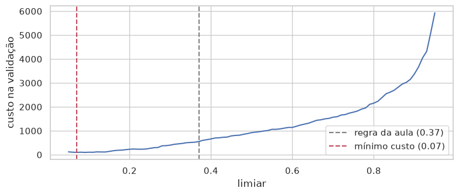

# AV1 — IA para Cibersegurança · Relatório

**Aluno:** Rafael Holder (individual) · **Notebook:** `aula5_modelagem_detector_malware_uci_splunk.ipynb` · CESAR School, 2026.2

## Contexto

O notebook treina um Random Forest para separar executáveis Windows benignos de malware usando a base UCI 541 (6.248 amostras, 90,5% malware, 28 features em três famílias: estrutura, entropia/seções e imports). Ao auditar a base, verifiquei que as 18 colunas de entropia, imports e `number_of_sections` têm apenas 2 valores diferentes de zero em cerca de 112 mil células. Como todo PE tem pelo menos uma seção, esses zeros são dado ausente, e o modelo acaba decidindo só com features de tamanho e layout do arquivo.

## Alteração 1 — Dados e Features

**O QUE fiz.** Retreinei o modelo em duas variantes: **1a**, sem as 18 features zeradas (sobram 10), e **1b**, sem as zeradas e também sem as 5 features de layout que podem denunciar a fonte da coleta (`image_base`, `file_alignment`, `section_alignment`, `size_of_headers`, `size_of_optional_header`), sobrando 5. A 1a ficou igual ao original: recall de benigno 0,832 nas duas, PR-AUC 0,997 nas duas e FN 48 contra 42. Na 1b o recall de benigno caiu de 0,832 para 0,588, os falsos positivos foram de 20 para 49 e o ROC-AUC caiu de 0,973 para 0,944. O recall de malware ficou estável (0,959).

**COMO fiz.** Criei a seção "AV1 — Experimentos" no fim do notebook, sem editar nenhuma célula original. A função `escolher_limiar` repete a regra da seção 9 (recall ≥ 95% com maior precisão), e `resumo` calcula FN, FP, recall por classe, PR-AUC e ROC-AUC no teste. Nas duas variantes usei o mesmo split 60/20/20, o mesmo `RANDOM_SEED = 42` e os mesmos hiperparâmetros (250 árvores, `min_samples_leaf=2`, `class_weight='balanced'`). Cada variante escolhe o próprio limiar só na validação (0,40 na 1a e 0,41 na 1b), e o teste apenas reporta.

**POR QUE fiz.** A pergunta era se o modelo detecta malware ou detecta de onde o arquivo veio. Os benignos vieram todos de *Program Files* do Windows 7/8, e os malwares vieram do VxHeaven e do VirusTotal. A 1a mostra que as features zeradas eram só ruído. A 1b mostra que, sem as marcas de layout da coleta, o modelo perde a capacidade de reconhecer os benignos. Ou seja, boa parte do desempenho vinha de reconhecer a "cara" dos programas instalados, não de comportamento malicioso. Isso também está ligado à evasão: tamanhos, alinhamentos e endereços são baratos de alterar com padding ou recompilação.

## Alteração 2 — Parâmetros e Decisão

**O QUE fiz.** Troquei a regra do limiar ("recall ≥ 95%") pelo limiar que minimiza o custo total dos erros na validação, com `CUSTO_FN = 10` e `CUSTO_FP = 1`, aplicado ao modelo original. O limiar caiu de 0,37 para 0,07. No teste, o malware liberado caiu de 42 para 4 (recall de malware 0,996), mas os benignos bloqueados subiram de 20 para 98 (recall de benigno 0,176). O custo no teste caiu de 440 para 138.

**COMO fiz.** Calculei `10·FN + 1·FP` na validação para cada limiar entre 0,05 e 0,95 (passo 0,01), escolhi o mínimo e plotei a curva de custo marcando os dois limiares. Depois fiz uma análise de sensibilidade com razões FN:FP de 1, 2, 5, 10 e 20. Os limiares ótimos foram 0,24, 0,14, 0,09, 0,07 e 0,07.

*Figura 1 — Custo total (10·FN + 1·FP) na validação para cada limiar. Cinza: regra da aula (0,37). Vermelho: mínimo custo (0,07).*

**POR QUE fiz.** Num antivírus os erros não custam o mesmo: um malware liberado pode virar incidente, e um programa bloqueado gera um chamado. A regra da aula fixa um alvo de recall sem olhar custo. O resultado mostra o lado ruim de minimizar só o custo: com 10:1 o modelo bloqueia 82% dos softwares legítimos, o que seria inviável na operação. A sensibilidade mostra que até com custos iguais o ótimo (0,24) fica abaixo de 0,37, porque malware é a maioria da base, e que a decisão depende muito de uma razão de custo que precisa vir do negócio e da capacidade do SOC, não do modelo.

## Tabela antes × depois (conjunto de teste)

| Experimento | nº feat. | limiar | recall malware | recall benigno | FN | FP | PR-AUC | ROC-AUC | custo (10:1) |
|---|---|---|---|---|---|---|---|---|---|
| Original (28 features) | 28 | 0,37 | 0,963 | 0,832 | 42 | 20 | 0,997 | 0,973 | 440 |
| Alt. 1a: sem zeradas | 10 | 0,40 | 0,958 | 0,832 | 48 | 20 | 0,997 | 0,974 | 500 |
| Alt. 1b: sem zeradas e sem origem | 5 | 0,41 | 0,959 | 0,588 | 46 | 49 | 0,994 | 0,944 | 509 |
| Alt. 2: limiar por custo 10:1 | 28 | 0,07 | 0,996 | 0,176 | 4 | 98 | 0,997 | 0,973 | 138 |

## Limitações

- **Viés de origem:** a fonte da coleta e o rótulo são praticamente a mesma coisa. Mesmo a 1b ainda usa tamanhos que podem refletir compilador e época de cada fonte.
- **Idade da base:** malwares antigos (VxHeaven) e de 2018, com benignos do Windows 7/8. O resultado não vale para ameaças atuais.
- **Split aleatório:** variantes da mesma família podem aparecer no treino e no teste e inflar as métricas. Seria mais robusto dividir por tempo ou por família.
- **Poucos benignos:** são 119 no teste, então cada FP vale cerca de 0,84 ponto no recall de benigno. Diferenças pequenas entre os experimentos (por exemplo, 42 contra 48 FN) estão dentro do ruído.
- **Reprodutibilidade:** executei localmente com scikit-learn 1.9.1. A execução no Colab escolheu limiar 0,46 em vez de 0,37 e deu números um pouco diferentes. As conclusões são as mesmas.
